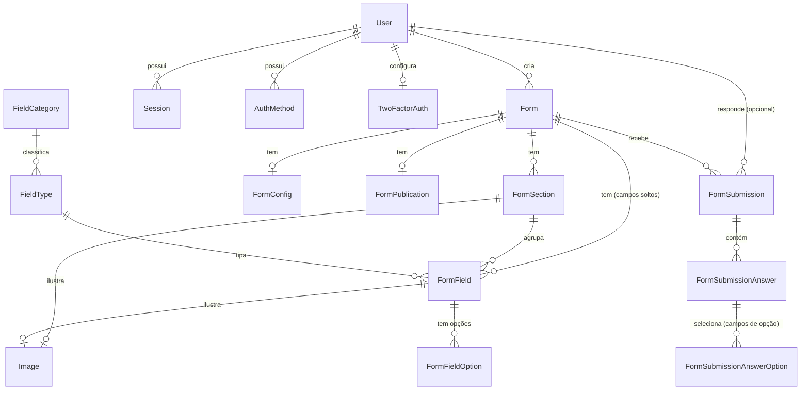
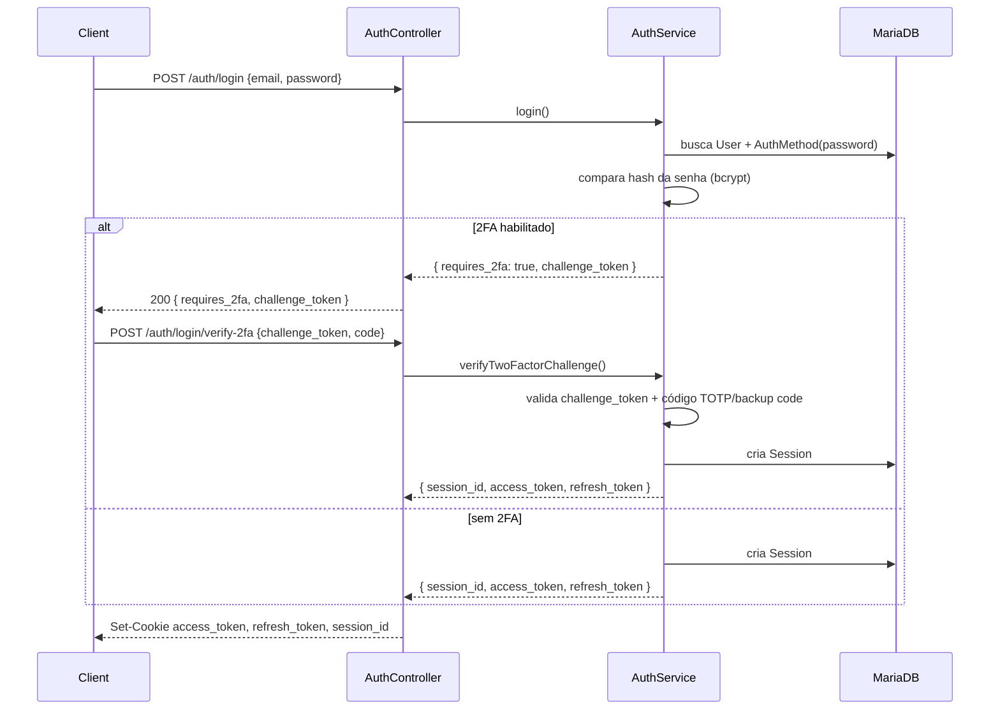
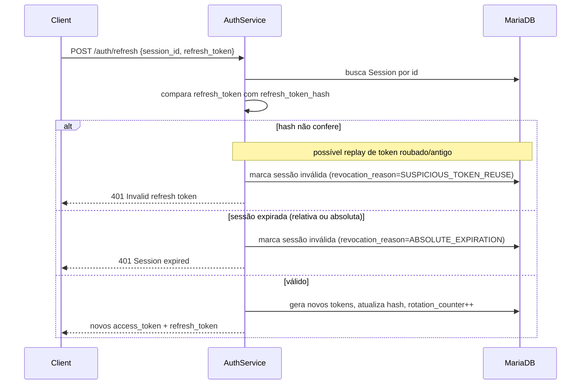
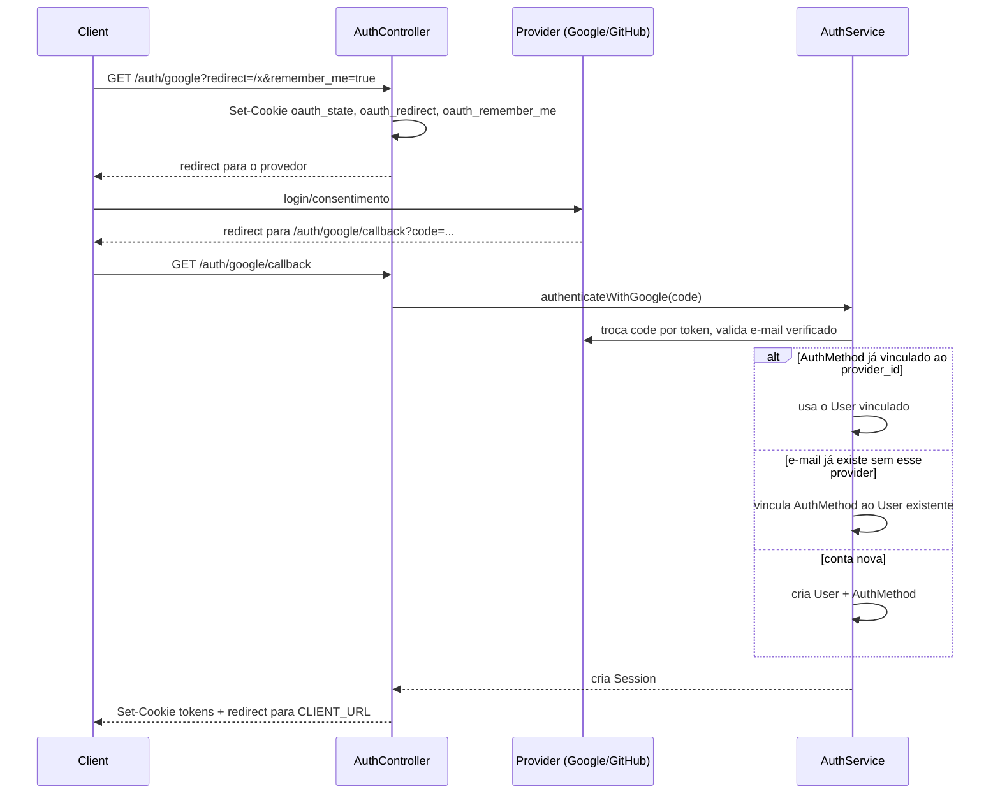
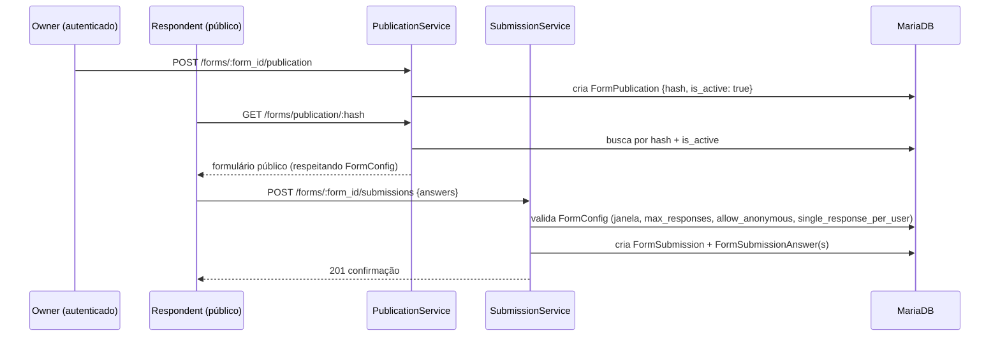
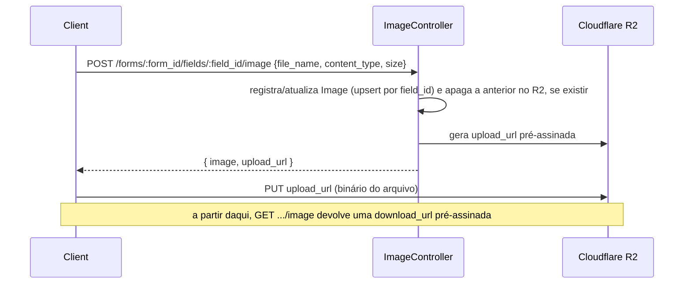

# Arquitetura

Este documento explica **como** e **por quê** o FormSystem API foi construído da forma como está — não repete o contrato de rotas, que vive em [docs/openapi.yaml](docs/openapi.yaml) e é servido em `/docs`. Leia isto se você precisa entender um fluxo completo (não só um endpoint) ou tomar uma decisão de design consistente com o que já existe.

## Sumário

- [Mapa de módulos](#mapa-de-módulos)
- [Modelo de dados](#modelo-de-dados)
- [Fluxo de autenticação](#fluxo-de-autenticação)
- [Sessões, refresh e rotação de tokens](#sessões-refresh-e-rotação-de-tokens)
- [Login social (OAuth)](#login-social-oauth)
- [Publicação e resposta de formulários](#publicação-e-resposta-de-formulários)
- [Upload de imagens](#upload-de-imagens)
- [Decisões de arquitetura](#decisões-de-arquitetura)

## Mapa de módulos

Cada domínio é um módulo Nest independente em `src/<module>`, seguindo sempre `controller → service → Prisma`:

| Módulo | Responsabilidade |
|---|---|
| `auth` | Login/registro por senha, sessões, OAuth (Google/GitHub), recuperação de senha, desafio de 2FA no login |
| `account` | Configurações de segurança da conta já autenticada: e-mail de recuperação, ativação/desativação de 2FA (TOTP) |
| `form` | CRUD de formulários e sua configuração (`FormConfig`: janela de disponibilidade, limite de respostas, etc.) |
| `section` | Seções de um formulário (agrupam campos) |
| `field` | Campos (perguntas) de um formulário/seção e suas opções |
| `image` | Upload de imagem para campo ou seção via URL pré-assinada (R2) |
| `publication` | Publica um formulário (gera hash público) e expõe a versão pública para resposta |
| `submission` | Recebe respostas de um formulário publicado e exporta respostas em CSV por e-mail |
| `shared` | Guards, decorators, services (Prisma, e-mail, R2, tokens, 2FA) e utils reaproveitados por todos os módulos acima |

## Modelo de dados

Entidades principais e seus relacionamentos (ver `prisma/schema.prisma` para o schema completo, incluindo colunas):

Pontos que não são óbvios olhando só o schema:

- `FormField.form_id` **e** `FormField.section_id` são opcionais e mutuamente relevantes: um campo pertence a um formulário diretamente (fora de seções) ou a uma seção — nunca precisa dos dois para existir.
- `Image` é dona da FK (`field_id` / `section_id`), não o contrário — por isso um campo/seção tem no máximo uma imagem (`@unique` nas duas colunas).
- `FormSubmission.respondent_id` é opcional: `FormConfig.allow_anonymous` decide se a resposta pode ser criada sem usuário autenticado.

## Fluxo de autenticação

Login por senha, com desvio para desafio de 2FA quando a conta tem TOTP habilitado:

`/auth/login` e `/auth/login/verify-2fa` são limitados a 5 tentativas/minuto (`@Throttle`) — proteção contra força bruta, não é o rate limit global.

## Sessões, refresh e rotação de tokens

Cada sessão guarda o **hash** do refresh token atual (`sessions.refresh_token_hash`), não o token em si. A cada `/auth/refresh`, o token é rotacionado: o antigo deixa de ser válido e um novo hash é salvo, com `rotation_counter` incrementado.

Duas expirações coexistem por sessão: `refresh_token_expires_at` (janela deslizante, estendida a cada refresh) e `absolutely_expires_at` (teto fixo desde a criação — a sessão morre mesmo com refreshes contínuos). `remember_me` só afeta a duração dessas janelas, definidas em `TOKENS_EXPIRES`/`SESSION_EXPIRES_DAYS`.

## Login social (OAuth)

Google e GitHub seguem o mesmo formato: o `state` do OAuth e as preferências do fluxo (`redirect`, `remember_me`) são guardados em cookies temporários antes do redirect para o provedor, e lidos de volta no callback.

Vincular por e-mail existente (sem exigir confirmação extra) é uma decisão deliberada de conveniência — assume que o e-mail do provedor OAuth já é verificado (checado explicitamente antes de prosseguir).

## Publicação e resposta de formulários

Um formulário só é respondível publicamente depois de publicado; a publicação gera um `hash` opaco que substitui o `form_id` nas rotas públicas.

A rota de criação de submissão não exige `JwtAuthGuard` — a autenticação é opcional e só relevante quando `allow_anonymous = false` ou `single_response_per_user = true`, validado dentro do `SubmissionService`, não no guard.

## Upload de imagens

Imagens não passam pela API — o cliente faz upload direto para o R2 usando uma URL pré-assinada, mantendo o binário fora do processo Node:

Cada campo/seção tem no máximo uma imagem: um novo upload substitui (upsert) a anterior e remove o objeto antigo do bucket, evitando lixo órfão no R2.

## Decisões de arquitetura

- **Zod em vez de `class-validator`**: validação via `ZodBody`/`ZodQuery` (decorators customizados em `shared/decorators`), o que centraliza schema + tipo (`z.infer`) num único arquivo por DTO. Isso muda o formato de erro de validação: `ValidationErrorResponse` retorna `message` como objeto (`{ "campo": "mensagem" }`), não string — ver `docs/schemas/common.yaml`.
- **OpenAPI escrito à mão, modular**: o projeto não usa `@nestjs/swagger` (decorators nos controllers). A spec é YAML hand-authored, dividida por módulo (`docs/paths/<module>.yaml`, `docs/schemas/<module>.yaml`) e agregada via `$ref` em `docs/openapi.yaml`, resolvida em runtime por `SwaggerParser.bundle()` (`src/main.ts`). Trade-off aceito: mais trabalho manual, mas desacopla a documentação da implementação dos controllers e evita um arquivo único gigante.
- **Rate limiting escopado, não global**: `ThrottlerModule` está registrado globalmente, mas o guard só é aplicado (`@UseGuards(ThrottlerGuard)` + `@Throttle`) nas rotas sensíveis a força bruta/abuso (login, registro, forgot/reset password). Rotas de leitura comuns não pagam esse custo. Essa mudança foi intencional (ver commit `6d9ea3d`) após o guard estar acoplado globalmente.
- **Refresh token rotation com detecção de reuso**: cada refresh invalida o token anterior; se um token já usado for reapresentado, a sessão inteira é revogada (`SUSPICIOUS_TOKEN_REUSE`) em vez de apenas rejeitar a requisição — limita o dano de um refresh token vazado/roubado.
- **Presigned URLs para upload/download de imagem**: a API nunca lê/grava o binário — apenas gera credenciais temporárias de acesso ao R2. Reduz carga no processo Node e evita limites de tamanho de payload no Express.
