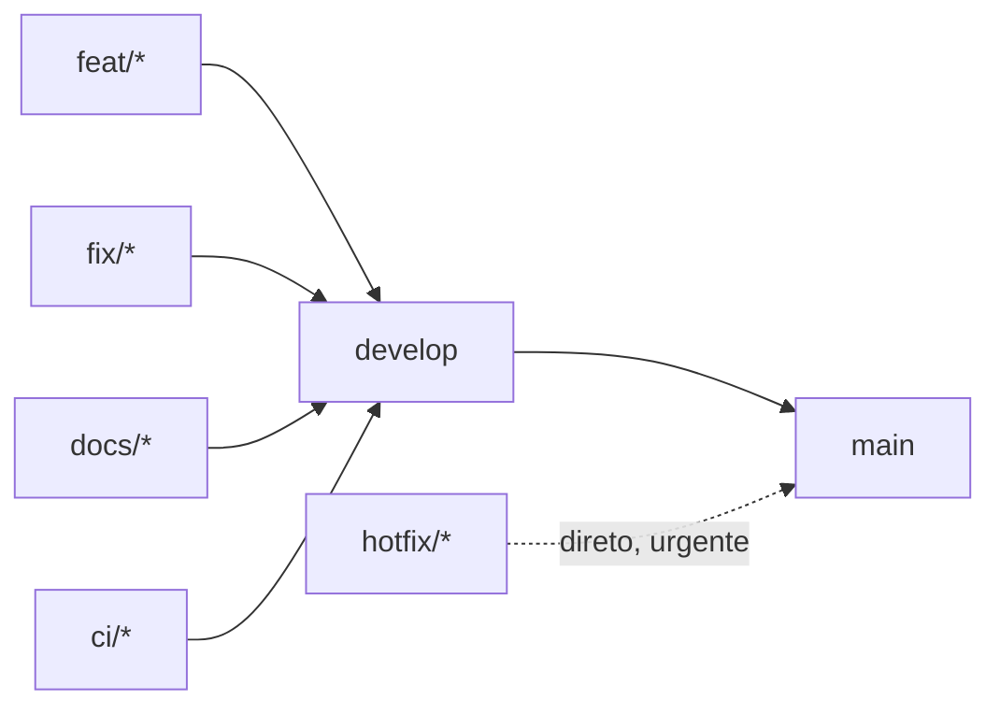

# Contribuindo

Guia de convenções usadas neste repositório. O objetivo é manter o histórico do Git legível e o processo de Pull Request previsível — não é um tutorial de setup (isso está no [README](README.md#-como-rodar-o-projeto)).

## 📑 Sumário

- [Fluxo de trabalho](#-fluxo-de-trabalho)
- [Branches](#-branches)
- [Commits](#-commits)
- [Antes de abrir um Pull Request](#-antes-de-abrir-um-pull-request)
- [Pull Requests](#-pull-requests)

## 🔀 Fluxo de trabalho

Todo trabalho nasce a partir de `develop` e volta para `develop` via Pull Request — nunca há push direto. `hotfix/*` é a única exceção: vai direto para `main`.



## 🌿 Branches

Nomeie branches como `<tipo>/<descrição-curta>`, a partir de `develop`:

| Prefixo   | Uso                                             | Exemplo real                        |
| --------- | ------------------------------------------------ | ------------------------------------ |
| `feat/`   | Nova funcionalidade                              | `feat/auth-otp`                      |
| `fix/`    | Correção de bug                                  | `fix/auth-flow`                      |
| `hotfix/` | Correção urgente, direto sobre `main`/produção   | `hotfix/rate-limit`                  |
| `docs/`   | Documentação (README, ARCHITECTURE, OpenAPI)     | `docs/swagger-api-documentation`     |
| `ci/`     | Docker, pipelines, configuração de build         | `ci/docker-compose`                  |

## 📝 Commits

Formato: `<emoji> <tipo>(<escopo opcional>): <descrição no imperativo>`

| Emoji | Tipo       | Quando usar                                                             |
| ----- | ---------- | ------------------------------------------------------------------------ |
| 🆕    | `feat`     | Nova funcionalidade ou endpoint                                         |
| 🐛    | `fix`      | Correção de bug                                                         |
| 🔧    | `refactor` | Mudança de estrutura interna sem alterar comportamento externo          |
| 📝    | `docs`     | Documentação (README, ARCHITECTURE, OpenAPI, comentários)               |
| 🐳    | `build`    | Docker, dependências, build                                             |
| ⚙️    | `chore`    | Configuração de projeto, setup inicial, tarefas de manutenção           |
| 🔀    | —          | Reservado para commits de merge (gerados pelo GitHub ao aceitar um PR)  |

O escopo entre parênteses é o(s) módulo(s) afetado(s) — `auth`, `account`, `ai`, `form`, `section`, `field`, `image`, `publication`, `submission`, `docs`, `docker`... Múltiplos módulos são separados por vírgula, sem espaço.

<details>
<summary>Exemplos reais do histórico</summary>

```
🆕 feat(account,auth): add two-factor authentication (TOTP) and recovery email management
🐛 fix(auth,account): scope rate limiting to sensitive routes instead of global guard
🔧 refactor(auth): add return types, OAuth URL constants, and structured session responses
📝 docs(api): add OpenAPI documentation for all modules
```

</details>

## ✅ Antes de abrir um Pull Request

- [ ] `npm run lint` e `npm run test` passam localmente
- [ ] `npm run test:e2e` passa, se a mudança envolve um fluxo completo (auth, publicação, submissão, geração via IA)

Se a mudança adiciona ou altera uma rota:

- [ ] Atualizou `docs/paths/<module>.yaml` **e** `docs/schemas/<module>.yaml` (nunca inline no `docs/openapi.yaml` raiz)
- [ ] Validou a spec:
  ```bash
  node -e "require('@apidevtools/swagger-parser').validate('docs/openapi.yaml').then(() => console.log('ok'))"
  ```
- [ ] Confirmou que toda rota pública (sem autenticação) define `security: []` explicitamente no YAML

Se a mudança afeta um fluxo documentado em [ARCHITECTURE.md](ARCHITECTURE.md) (autenticação, sessões, OAuth, publicação, upload de imagens, geração via IA):

- [ ] Atualizou o diagrama e o texto correspondentes

Se a mudança é relevante para quem consome a API (novo endpoint, comportamento alterado, campo removido):

- [ ] Adicionou uma entrada em [CHANGELOG.md](CHANGELOG.md), seguindo [Keep a Changelog](https://keepachangelog.com/pt-BR/1.0.0/)

## 🔁 Pull Requests

- Título curto, no mesmo padrão dos commits (`🆕 feat(form): ...`)
- Descreva o **porquê** da mudança, não só o **o quê** — o diff já mostra o que mudou
- `hotfix/*` pode ir direto para `main`; os demais passam por `develop`
