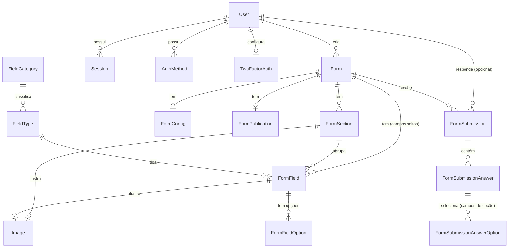
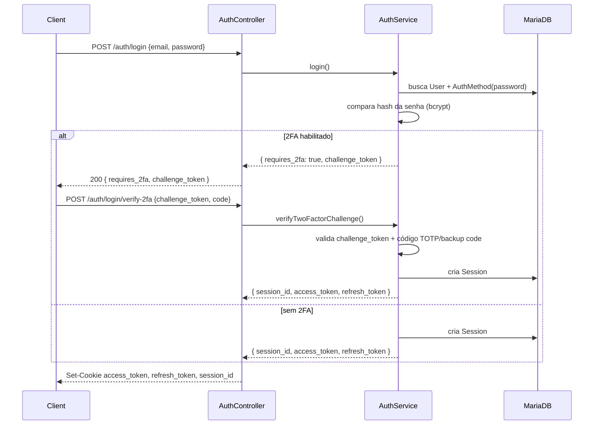
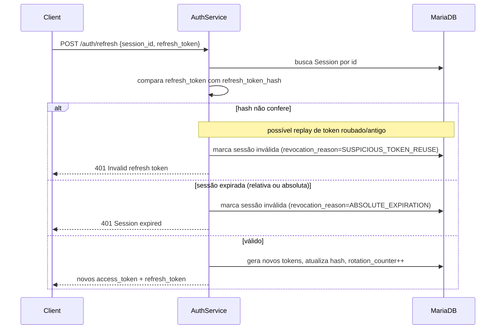
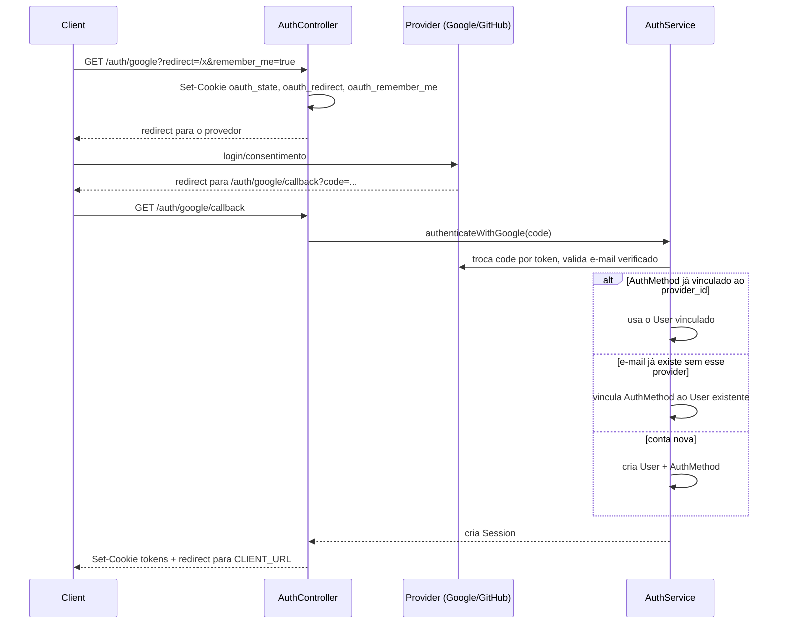
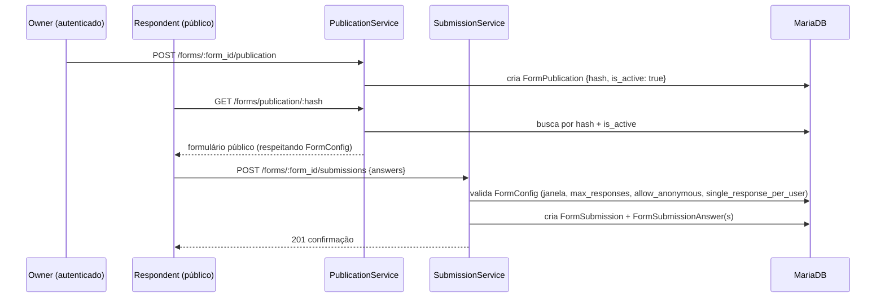
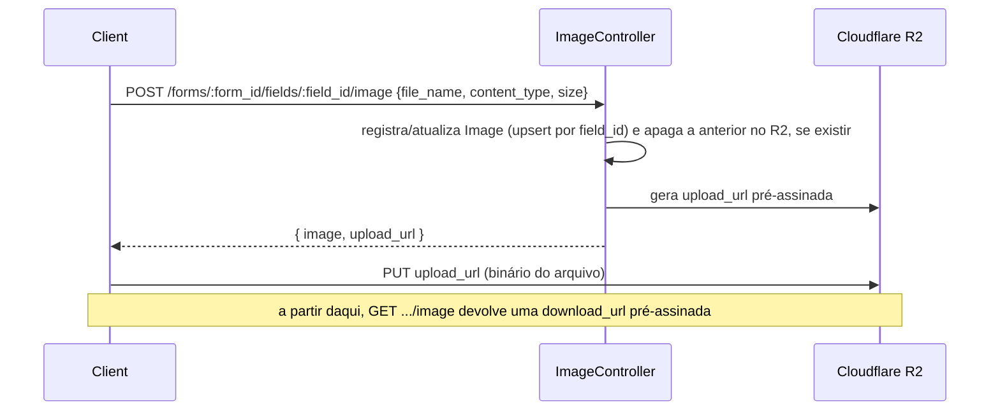

# form-system-api


[](https://formsystemapp.com)

API REST para criação de formulários dinâmicos — do desenho do formulário à análise das respostas. Um usuário monta seções e campos, publica o formulário através de um link público e acompanha as respostas recebidas, com exportação em CSV.

**🔗 Aplicação em produção:** [formsystemapp.com](https://formsystemapp.com)

Principais capacidades:

- **Formulários dinâmicos** — seções, campos tipados (texto, opções, etc.), reordenação, clonagem e mesclagem de seções

- **Publicação pública** — cada formulário publicado ganha um link único, respeitando regras de disponibilidade, limite de respostas e respostas anônimas

- **Coleta e exportação de respostas** — submissões versionáveis por respondente e exportação em CSV enviada por e-mail

- **Autenticação completa** — sessões JWT rotativas, login social (Google/GitHub) e autenticação de dois fatores (TOTP)

- **Upload de imagens** — anexadas a campos ou seções via URL pré-assinada (Cloudflare R2), sem passar pela API

## 📑 Sumário

- [🧰 Stack tecnológica](#-stack-tecnológica)
- [✨ Destaques técnicos](#-destaques-técnicos)
- [🚀 Como rodar o projeto](#-como-rodar-o-projeto)
- [⚙️ Variáveis de ambiente](#️-variáveis-de-ambiente)
- [📖 Documentação da API](#-documentação-da-api)
- [🏗️ Arquitetura](#️-arquitetura)
  - [Mapa de módulos](#mapa-de-módulos)
  - [Modelo de dados](#modelo-de-dados)
  - [Fluxo de autenticação](#fluxo-de-autenticação)
  - [Sessões, refresh e rotação de tokens](#sessões-refresh-e-rotação-de-tokens)
  - [Login social (OAuth)](#login-social-oauth)
  - [Publicação e resposta de formulários](#publicação-e-resposta-de-formulários)
  - [Upload de imagens](#upload-de-imagens)
  - [Decisões de arquitetura](#decisões-de-arquitetura)
- [📜 Scripts disponíveis](#-scripts-disponíveis)
- [📄 Licença](#-licença)

## 🧰 Stack tecnológica

| Camada                    | Tecnologia                                                                    |
| ------------------------- | ----------------------------------------------------------------------------- |
| Framework                 | NestJS 11 (Express)                                                           |
| Linguagem                 | TypeScript                                                                    |
| Banco de dados            | MariaDB / MySQL, via Prisma ORM                                               |
| Validação                 | Zod (pipe customizado, não usa `class-validator`)                             |
| Autenticação              | JWT (access + refresh) em cookie httpOnly, OAuth2 (Google/GitHub), TOTP (2FA) |
| Armazenamento de arquivos | Cloudflare R2 (S3-compatible), via URLs pré-assinadas                         |
| E-mail                    | Resend                                                                        |
| Rate limiting             | `@nestjs/throttler`, escopado nas rotas sensíveis                             |
| Documentação da API       | OpenAPI 3 (YAML manual, modular) + Swagger UI                                 |
| Containerização           | Docker multi-stage + docker-compose                                           |

## ✨ Destaques técnicos

- **Refresh token rotation com detecção de reuso** — cada `/auth/refresh` invalida o token anterior; se um token já usado for reapresentado, a sessão inteira é revogada (`SUSPICIOUS_TOKEN_REUSE`) em vez de só rejeitar a requisição, limitando o dano de um refresh token vazado. Ver [detalhes](#sessões-refresh-e-rotação-de-tokens).

- **Presigned URLs para upload/download de imagem** — o binário nunca passa pela API: o cliente envia direto para o Cloudflare R2 usando uma URL pré-assinada, sem consumir memória/tempo do processo Node. Ver [detalhes](#upload-de-imagens).

- **Zod no lugar de `class-validator`** — validação via decorators customizados (`ZodBody`/`ZodQuery`) que centralizam schema e tipo (`z.infer`) num único arquivo por DTO. Ver [detalhes](#decisões-de-arquitetura).

- **OpenAPI escrito à mão, modular** — sem `@nestjs/swagger`; a spec YAML é dividida por módulo (`docs/paths/`, `docs/schemas/`) e agregada por `$ref`, desacoplando a documentação da implementação dos controllers. Ver [detalhes](#decisões-de-arquitetura).

- **Rate limiting escopado, não global** — o `ThrottlerGuard` só é aplicado nas rotas sensíveis a força bruta (login, registro, reset de senha), poupando as rotas de leitura comuns desse custo. Ver [detalhes](#decisões-de-arquitetura).

O mapa completo de módulos, o modelo de dados e os diagramas de cada fluxo (autenticação, publicação, submissão) estão na seção [🏗️ Arquitetura](#️-arquitetura) abaixo.

## 🚀 Como rodar o projeto

### Pré-requisitos

- Node.js 22+
- Docker e Docker Compose (recomendado) **ou** uma instância MariaDB/MySQL local

### Passo a passo (com Docker)

```bash
# 1. Clone o repositório
git clone <repo-url>
cd api-form-system

# 2. Copie o arquivo de exemplo e preencha as variáveis
cp .example-env .env

# 3. Suba a API e o banco de dados
docker compose up --build
```

O container da API já roda `prisma migrate deploy` automaticamente antes de subir (ver `Dockerfile`).

### Passo a passo (ambiente local, sem Docker)

```bash
npm install
cp .example-env .env   # aponte DATABASE_URL para seu banco local
npx prisma migrate dev
npm run start:dev
```

A API sobe em `http://localhost:${PORT}` (padrão `3001`).

## ⚙️ Variáveis de ambiente

Todas as variáveis estão listadas em [.example-env](.example-env). Principais grupos:

| Grupo          | Variáveis                                                                                               | Descrição                                                            |
| -------------- | ------------------------------------------------------------------------------------------------------- | -------------------------------------------------------------------- |
| App            | `NODE_ENV`, `PORT`, `APP_NAME`, `CLIENT_URL`, `CORS_ORIGINS`, `COOKIE_DOMAIN`                           | Configuração geral e CORS/cookies                                    |
| Banco de dados | `DATABASE_URL`, `DATABASE_HOST`, `DATABASE_PORT`, `DATABASE_USER`, `DATABASE_PASSWORD`, `DATABASE_NAME` | Conexão MariaDB via Prisma                                           |
| Autenticação   | `JWT_SECRET`, `JWT_REFRESH_SECRET`, `JWT_EXPIRES_IN`, `JWT_REFRESH_EXPIRES_IN`, `APP_ENCRYPTION_KEY`    | Assinatura de tokens e criptografia de segredos (ex.: 2FA)           |
| OAuth          | `GOOGLE_CLIENT_ID/SECRET/CALLBACK_URL`, `GITHUB_CLIENT_ID/SECRET/CALLBACK_URL`                          | Login social                                                         |
| E-mail         | `RESEND_API_KEY`, `MAIL_FROM`                                                                           | Envio de e-mails transacionais (reset de senha, export de respostas) |
| Armazenamento  | `R2_ACCOUNT_ID`, `R2_ACCESS_KEY_ID`, `R2_SECRET_ACCESS_KEY`, `R2_API_TOKEN`, `R2_BUCKET`                | Upload de imagens via Cloudflare R2                                  |

## 📖 Documentação da API

A referência completa de rotas, payloads, respostas e erros de validação é gerada a partir da spec OpenAPI 3 modular (`docs/openapi.yaml`, agregando `docs/paths/` e `docs/schemas/` por módulo) e servida via Swagger UI:

```
GET /docs
```

Em produção, `/docs` fica protegido por Basic Auth. A spec OpenAPI é a fonte de verdade para o contrato de endpoints — evite duplicar essa documentação aqui no README.

## 🏗️ Arquitetura

Como e por quê o FormSystem API foi construído da forma como está — não repete o contrato de rotas (ver [📖 Documentação da API](#-documentação-da-api) acima). Leia isto se você precisa entender um fluxo completo (não só um endpoint) ou tomar uma decisão de design consistente com o que já existe.

### Mapa de módulos

Cada domínio é um módulo Nest independente em `src/<module>`, seguindo sempre `controller → service → Prisma`:

| Módulo | Responsabilidade |
|---|---|
| `auth` | Login/registro por senha, sessões, OAuth (Google/GitHub), recuperação de senha, desafio de 2FA no login |
| `account` | Configurações de segurança da conta já autenticada: e-mail de recuperação, ativação/desativação de 2FA (TOTP) |
| `form` | CRUD de formulários e sua configuração (`FormConfig`: janela de disponibilidade, limite de respostas, etc.) |
| `section` | Seções de um formulário (agrupam campos) |
| `field` | Campos (perguntas) de um formulário/seção e suas opções |
| `image` | Upload de imagem para campo ou seção via URL pré-assinada (R2) |
| `publication` | Publica um formulário (gera hash público) e expõe a versão pública para resposta |
| `submission` | Recebe respostas de um formulário publicado e exporta respostas em CSV por e-mail |
| `shared` | Guards, decorators, services (Prisma, e-mail, R2, tokens, 2FA) e utils reaproveitados por todos os módulos acima |

### Modelo de dados

Entidades principais e seus relacionamentos (ver `prisma/schema.prisma` para o schema completo, incluindo colunas):



Pontos que não são óbvios olhando só o schema:

- `FormField.form_id` **e** `FormField.section_id` são opcionais e mutuamente relevantes: um campo pertence a um formulário diretamente (fora de seções) ou a uma seção — nunca precisa dos dois para existir.
- `Image` é dona da FK (`field_id` / `section_id`), não o contrário — por isso um campo/seção tem no máximo uma imagem (`@unique` nas duas colunas).
- `FormSubmission.respondent_id` é opcional: `FormConfig.allow_anonymous` decide se a resposta pode ser criada sem usuário autenticado.

### Fluxo de autenticação

Login por senha, com desvio para desafio de 2FA quando a conta tem TOTP habilitado:



`/auth/login` e `/auth/login/verify-2fa` são limitados a 5 tentativas/minuto (`@Throttle`) — proteção contra força bruta, não é o rate limit global.

### Sessões, refresh e rotação de tokens

Cada sessão guarda o **hash** do refresh token atual (`sessions.refresh_token_hash`), não o token em si. A cada `/auth/refresh`, o token é rotacionado: o antigo deixa de ser válido e um novo hash é salvo, com `rotation_counter` incrementado.



Duas expirações coexistem por sessão: `refresh_token_expires_at` (janela deslizante, estendida a cada refresh) e `absolutely_expires_at` (teto fixo desde a criação — a sessão morre mesmo com refreshes contínuos). `remember_me` só afeta a duração dessas janelas, definidas em `TOKENS_EXPIRES`/`SESSION_EXPIRES_DAYS`.

### Login social (OAuth)

Google e GitHub seguem o mesmo formato: o `state` do OAuth e as preferências do fluxo (`redirect`, `remember_me`) são guardados em cookies temporários antes do redirect para o provedor, e lidos de volta no callback.



Vincular por e-mail existente (sem exigir confirmação extra) é uma decisão deliberada de conveniência — assume que o e-mail do provedor OAuth já é verificado (checado explicitamente antes de prosseguir).

### Publicação e resposta de formulários

Um formulário só é respondível publicamente depois de publicado; a publicação gera um `hash` opaco que substitui o `form_id` nas rotas públicas.



A rota de criação de submissão não exige `JwtAuthGuard` — a autenticação é opcional e só relevante quando `allow_anonymous = false` ou `single_response_per_user = true`, validado dentro do `SubmissionService`, não no guard.

### Upload de imagens

Imagens não passam pela API — o cliente faz upload direto para o R2 usando uma URL pré-assinada, mantendo o binário fora do processo Node:



Cada campo/seção tem no máximo uma imagem: um novo upload substitui (upsert) a anterior e remove o objeto antigo do bucket, evitando lixo órfão no R2.

### Decisões de arquitetura

- **Zod em vez de `class-validator`**: validação via `ZodBody`/`ZodQuery` (decorators customizados em `shared/decorators`), o que centraliza schema + tipo (`z.infer`) num único arquivo por DTO. Isso muda o formato de erro de validação: `ValidationErrorResponse` retorna `message` como objeto (`{ "campo": "mensagem" }`), não string — ver `docs/schemas/common.yaml`.

- **OpenAPI escrito à mão, modular**: o projeto não usa `@nestjs/swagger` (decorators nos controllers). A spec é YAML hand-authored, dividida por módulo (`docs/paths/<module>.yaml`, `docs/schemas/<module>.yaml`) e agregada via `$ref` em `docs/openapi.yaml`, resolvida em runtime por `SwaggerParser.bundle()` (`src/main.ts`). Trade-off aceito: mais trabalho manual, mas desacopla a documentação da implementação dos controllers e evita um arquivo único gigante.

- **Rate limiting escopado, não global**: `ThrottlerModule` está registrado globalmente, mas o guard só é aplicado (`@UseGuards(ThrottlerGuard)` + `@Throttle`) nas rotas sensíveis a força bruta/abuso (login, registro, forgot/reset password). Rotas de leitura comuns não pagam esse custo. Essa mudança foi intencional (ver commit `6d9ea3d`) após o guard estar acoplado globalmente.

- **Refresh token rotation com detecção de reuso**: cada refresh invalida o token anterior; se um token já usado for reapresentado, a sessão inteira é revogada (`SUSPICIOUS_TOKEN_REUSE`) em vez de apenas rejeitar a requisição — limita o dano de um refresh token vazado/roubado.

- **Presigned URLs para upload/download de imagem**: a API nunca lê/grava o binário — apenas gera credenciais temporárias de acesso ao R2. Reduz carga no processo Node e evita limites de tamanho de payload no Express.

## 📜 Scripts disponíveis

| Script               | Descrição                                           |
| -------------------- | --------------------------------------------------- |
| `npm run start:dev`  | Sobe a API em modo watch                            |
| `npm run build`      | Compila para `dist/`                                |
| `npm run start:prod` | Roda o build de produção (`dist/main`)              |
| `npm run lint`       | ESLint com `--fix`                                  |
| `npm run format`     | Formata `src`, `prisma/seeds` e `test` com Prettier |
| `npm run test`       | Testes unitários (Jest)                             |
| `npm run test:e2e`   | Testes end-to-end                                   |
| `npm run test:cov`   | Testes com relatório de cobertura                   |

## 📄 Licença

Distribuído sob a licença [Apache 2.0](LICENSE).
