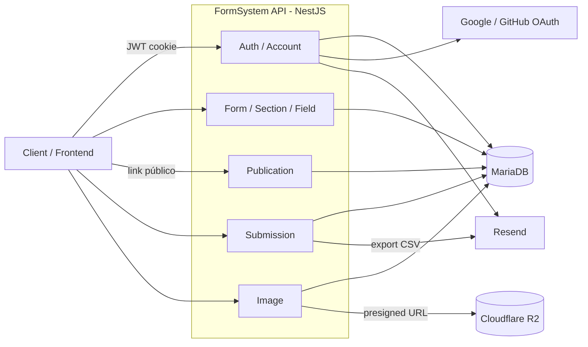

# FormSystem API


API REST para criação de formulários dinâmicos: montagem de seções e campos, publicação pública via link, coleta de respostas e exportação de resultados. Inclui autenticação própria com sessões rotativas, login social (Google/GitHub) e autenticação de dois fatores (TOTP).

## Sumário

- [Stack tecnológica](#stack-tecnológica)
- [Arquitetura em alto nível](#arquitetura-em-alto-nível)
- [Como rodar o projeto](#como-rodar-o-projeto)
- [Variáveis de ambiente](#variáveis-de-ambiente)
- [Documentação da API](#documentação-da-api)
- [Scripts disponíveis](#scripts-disponíveis)
- [Estrutura do projeto](#estrutura-do-projeto)
- [Testes](#testes)
- [Mais documentação](#mais-documentação)

## Stack tecnológica

| Camada                    | Tecnologia                                                                    |
| ------------------------- | ----------------------------------------------------------------------------- |
| Framework                 | NestJS 11 (Express)                                                           |
| Linguagem                 | TypeScript                                                                    |
| Banco de dados            | MariaDB / MySQL, via Prisma ORM                                               |
| Validação                 | Zod (pipe customizado, não usa `class-validator`)                             |
| Autenticação              | JWT (access + refresh) em cookie httpOnly, OAuth2 (Google/GitHub), TOTP (2FA) |
| Armazenamento de arquivos | Cloudflare R2 (S3-compatible), via URLs pré-assinadas                         |
| E-mail                    | Resend                                                                        |
| Rate limiting             | `@nestjs/throttler`, escopado nas rotas sensíveis                             |
| Documentação da API       | OpenAPI 3 (YAML manual, modular) + Swagger UI                                 |
| Containerização           | Docker multi-stage + docker-compose                                           |

## Arquitetura em alto nível



Cada módulo em `src/<module>` corresponde a um domínio do sistema e segue o mesmo padrão: `controller` → `service` → Prisma. Detalhes de cada fluxo (autenticação, publicação, submissão) estão em [ARCHITECTURE.md](ARCHITECTURE.md).

## Como rodar o projeto

### Pré-requisitos

- Node.js 22+
- Docker e Docker Compose (recomendado) **ou** uma instância MariaDB/MySQL local

### Passo a passo (com Docker)

```bash
# 1. Clone o repositório
git clone <repo-url>
cd api-form-system

# 2. Copie o arquivo de exemplo e preencha as variáveis
cp .example-env .env

# 3. Suba a API e o banco de dados
docker compose up --build
```

O container da API já roda `prisma migrate deploy` automaticamente antes de subir (ver `Dockerfile`).

### Passo a passo (ambiente local, sem Docker)

```bash
npm install
cp .example-env .env   # aponte DATABASE_URL para seu banco local
npx prisma migrate dev
npm run start:dev
```

A API sobe em `http://localhost:${PORT}` (padrão `3001`).

## Variáveis de ambiente

Todas as variáveis estão listadas em [.example-env](.example-env). Principais grupos:

| Grupo          | Variáveis                                                                                               | Descrição                                                            |
| -------------- | ------------------------------------------------------------------------------------------------------- | -------------------------------------------------------------------- |
| App            | `NODE_ENV`, `PORT`, `APP_NAME`, `CLIENT_URL`, `CORS_ORIGINS`, `COOKIE_DOMAIN`                           | Configuração geral e CORS/cookies                                    |
| Banco de dados | `DATABASE_URL`, `DATABASE_HOST`, `DATABASE_PORT`, `DATABASE_USER`, `DATABASE_PASSWORD`, `DATABASE_NAME` | Conexão MariaDB via Prisma                                           |
| Autenticação   | `JWT_SECRET`, `JWT_REFRESH_SECRET`, `JWT_EXPIRES_IN`, `JWT_REFRESH_EXPIRES_IN`, `APP_ENCRYPTION_KEY`    | Assinatura de tokens e criptografia de segredos (ex.: 2FA)           |
| OAuth          | `GOOGLE_CLIENT_ID/SECRET/CALLBACK_URL`, `GITHUB_CLIENT_ID/SECRET/CALLBACK_URL`                          | Login social                                                         |
| E-mail         | `RESEND_API_KEY`, `MAIL_FROM`                                                                           | Envio de e-mails transacionais (reset de senha, export de respostas) |
| Armazenamento  | `R2_ACCOUNT_ID`, `R2_ACCESS_KEY_ID`, `R2_SECRET_ACCESS_KEY`, `R2_API_TOKEN`, `R2_BUCKET`                | Upload de imagens via Cloudflare R2                                  |

## Documentação da API

A referência completa de rotas, payloads e respostas é gerada a partir de `docs/openapi.yaml` (spec modular, ver `docs/paths/` e `docs/schemas/`) e servida via Swagger UI:

```
GET /docs
```

Em produção, `/docs` fica protegido por Basic Auth (ver `src/shared/utils/docsBasicAuth.ts`). Não duplique a documentação de endpoints aqui no README — a spec OpenAPI é a fonte de verdade.

## Scripts disponíveis

| Script               | Descrição                                           |
| -------------------- | --------------------------------------------------- |
| `npm run start:dev`  | Sobe a API em modo watch                            |
| `npm run build`      | Compila para `dist/`                                |
| `npm run start:prod` | Roda o build de produção (`dist/main`)              |
| `npm run lint`       | ESLint com `--fix`                                  |
| `npm run format`     | Formata `src`, `prisma/seeds` e `test` com Prettier |
| `npm run test`       | Testes unitários (Jest)                             |
| `npm run test:e2e`   | Testes end-to-end                                   |
| `npm run test:cov`   | Testes com relatório de cobertura                   |

## Estrutura do projeto

```
src/
  account/       # configurações de segurança da conta (e-mail de recuperação, 2FA)
  auth/          # login, registro, sessões, OAuth, recuperação de senha
  form/          # CRUD de formulários e configuração
  section/       # seções de um formulário
  field/         # campos (perguntas) e opções
  image/         # upload de imagens (presigned URL para R2)
  publication/   # exposição pública de um formulário publicado
  submission/    # respostas de formulários e exportação
  shared/        # guards, decorators, services e utils reutilizados entre módulos
prisma/          # schema.prisma e seeds
docs/            # OpenAPI (paths/ e schemas/ por módulo) + documentação técnica
```

Cada módulo de domínio segue a mesma convenção: `*.module.ts`, `*.controller.ts`, `*.service.ts`, `dto/` (schemas Zod) e `interface/` (tipos usados entre controller e service).

## Testes

```bash
npm run test        # unitários
npm run test:e2e     # end-to-end (test/jest-e2e.json)
npm run test:cov     # cobertura
```

## Mais documentação

- [ARCHITECTURE.md](ARCHITECTURE.md) — decisões de arquitetura, modelo de dados e fluxos (autenticação, publicação, upload de imagens)
- [CONTRIBUTING.md](CONTRIBUTING.md) — padrão de commits, branches e processo de PR

## Licença

Distribuído sob a licença [Apache 2.0](LICENSE).
